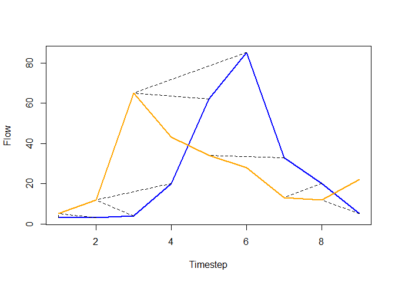

<!-- README.md is generated from README.Rmd. Please edit that file -->

# objectivER 

<!-- badges: start -->

[](https://lifecycle.r-lib.org/articles/stages.html#stable)
[](https://cran.r-project.org/web/licenses/GNU%20General%20Public%20License)
[](https://github.com/JonPayneEA/objectivER/commits/master)
[](https://github.com/JonPayneEA/objectivER)
<!-- badges: end -->

The goal of objectivER is to …

## Installation

You can install the development version of objectivER from
[GitHub](https://github.com/) with:

``` r
# install.packages("devtools")
devtools::install_github("JonPayne88/objectivER")
```

## Example - Hydrograph matching algorithm

This is a basic example which shows you how to solve a common problem:

``` r
library(objectivER)
```

``` r
qo <- c(3, 3, 4, 20, 62, 85, 33, 20, 5)
qs <- c(5, 12, 65, 43, 34, 28, 13, 12, 22)
a <- HMA(obs = qo, sim = qs, b = 4, maxLag = 1, maxLead = 3, measure = 'nse')
plot(qo, type = 'l', col = 'blue', lwd = 2,
     xlab = 'Timestep',
          ylab = 'Flow')
          lines(qs, col = 'orange', lwd = 2)
          for (i in seq_along(a$Rays)){
            segments(a$Rays[[i]]$obs[1], a$Rays[[i]]$obs[2], a$Rays[[i]]$sim[1], a$Rays[[i]]$sim[2], lty = 2)
            }
```


